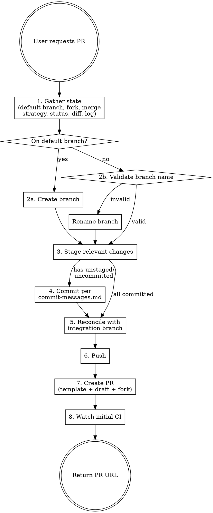

# GitHub Pull Request

Prepare and open a clean, reviewable Pull Request on GitHub.

## Overview

A PR-ready branch must be: on a correctly named branch, reconciled with the integration branch (rebase by default; merge or skip when project policy says so), with only relevant changes committed per `commit-messages.md`.

## Workflow



## Steps

### 1. Gather state

Detect repo metadata and working-tree state:

```bash
# Default integration branch (don't assume "main")
DEFAULT_BRANCH=$(git symbolic-ref --short refs/remotes/origin/HEAD 2>/dev/null | sed 's@^origin/@@')
DEFAULT_BRANCH=${DEFAULT_BRANCH:-main}

# Repo metadata: fork status, allowed merge strategies, default branch
gh repo view --json isFork,defaultBranchRef,mergeCommitAllowed,squashMergeAllowed,rebaseMergeAllowed

# Working tree
git status
git diff
git diff --cached

# Branch position vs. integration branch
git fetch origin "$DEFAULT_BRANCH"
git log "origin/$DEFAULT_BRANCH..HEAD" --oneline
git rev-list --left-right --count "origin/$DEFAULT_BRANCH...HEAD"

# Commit style reference (still useful in case the project deviates from commit-messages.md)
git log --oneline -10
```

### 2. Branch

**If on the default branch:** Create a new branch before anything else. Derive the name from the actual changes — never use placeholders.

```bash
git checkout -b <type>/<description>
```

**If only some commits should be in the PR:** Branch from the integration branch and cherry-pick:

```bash
git checkout -b <type>/<description> "origin/$DEFAULT_BRANCH"
git cherry-pick <commit-hash>
```

**Branch prefix mirrors the dominant commit type** (defined in `commit-messages.md`):

`feature/`, `fix/`, `chore/`, `docs/`, `test/`, `refactor/`, `style/`, `perf/`

If the current branch name doesn't match, rename:

```bash
git branch -m old-name <type>/<description>
```

If the old name was already pushed, the old remote ref will be cleaned up after pushing the new name. This is standard branch hygiene, not a destructive operation.

### 3. Stage relevant changes only

Analyze the diff to decide what belongs. Stage files individually by path — never use `git add .` or `git add -A`.

**Exclude:**

- Auto-generated files unrelated to the change (lock files, import maps, compiled output)
- `.env*`, credentials, secrets — never commit these
- Untracked personal files (notes, scratch files)
- Changes unrelated to the PR's purpose

**Include:**

- All files directly related to the change
- Lock files **only** if a dependency was intentionally added/removed as part of this work
- Generated files **only** if they result from the committed changes (updated types, migrations, etc.)

Make the call yourself by inspecting the diff content. Don't ask the user about each file — analyze whether the change is related and act. Only ask if truly ambiguous after inspection.

### 4. Commit

Build the commit subject and body per `commit-messages.md` (Conventional Commits: `<type>(<scope>): <description>`, body explains the _why_).

If the branch already has well-formed commits, don't re-commit — move to step 5.

### 5. Reconcile with the integration branch

**Default: rebase.**

```bash
git fetch origin "$DEFAULT_BRANCH"
git rebase "origin/$DEFAULT_BRANCH"
```

Rebasing a feature branch is standard pre-PR hygiene, not a destructive operation.

**Use a non-rebase path when the project says so:**

- **`CONTRIBUTING.md` or PR template forbids rebase / requires merge commits** → `git merge "origin/$DEFAULT_BRANCH"` instead.
- **Repo's merge strategy is squash-only and the maintainer rebases at merge time** (`gh repo view --json squashMergeAllowed,rebaseMergeAllowed,mergeCommitAllowed` shows squash-only) → skip the author-side rebase to avoid churn.
- **Branch protection forbids force-push to PR branches** → skip the rebase or you'll be blocked at push time.

If conflicts arise, resolve them. Non-trivial resolution: inform the user and resolve together.

### 6. Push

```bash
git push -u origin "$BRANCH"        # first push, same-repo PR
git push --force-with-lease         # after rebase, history rewritten
```

Always `--force-with-lease`, never `--force` — protects against overwriting someone else's pushes.

**Fork PRs:** push to your fork's remote (typically named after your GitHub login or `fork`) instead of `origin`. Reference the fork in step 7.

### 7. Create the PR

**Check for a project PR template before composing the body:**

```bash
ls .github/PULL_REQUEST_TEMPLATE.md \
   .github/pull_request_template.md \
   docs/PULL_REQUEST_TEMPLATE.md 2>/dev/null
```

If a template exists, use it as the body skeleton — preserve its section headings, fill in real content from the diff and commit history. If none exists, use the default Summary + Test plan template.

**Decide whether the PR is frontend work.** Judge from the diff content, not just paths: UI components, client-side JS/TS, styles/Tailwind, markup, frontend routing, client state, assets, frontend tooling config. Backend-only, infra, docs-only, or mixed-with-no-frontend changes don't qualify — when in doubt, skip the label rather than mislabel.

**If (and only if) the changes are frontend-related, ensure the `frontend` label exists before creating the PR** (labels live in the base repo — check there, not the fork):

```bash
gh label list --json name --jq '.[].name' | grep -qx "frontend" \
  || gh label create frontend --color "1D76DB" --description "Frontend work"
```

If label creation fails (no triage/push permission on the base repo), create the PR without the label and tell the user.

```bash
gh pr create --base "$DEFAULT_BRANCH" \
  --assignee @me \
  --label frontend \
  --title "<type>(<scope>): <concise description>" \
  --body "$(cat <<'EOF'
## Summary
<1-3 bullets describing what changed and why>

## Test plan
<Checklist of verification steps a reviewer can follow>
EOF
)"
```

**Default flags:**

- `--assignee @me` — always assign the PR to the author, unless the user explicitly asks otherwise.
- `--label frontend` — only when the diff is frontend work (created above if missing); omit for non-frontend PRs.

**Flags to add when applicable:**

- `--draft` when the work isn't ready for review yet (signals to reviewers, blocks merge until marked ready).
- `--head <user>:<branch>` when working from a fork.

**Title:** ≤ 70 characters, Conventional Commits format, derived from the diff.
**Summary:** Bullet points covering the actual changes, not restating the title.
**Test plan:** Concrete verification steps.

### 8. Watch the initial CI run

```bash
gh pr checks --watch
```

If any check fails, surface the failure to the user and resolve before declaring the task done. A green CI run is part of "PR ready for review" — see `superpowers:verification-before-completion`.

Return the PR URL.

## Common Mistakes

| Mistake                                         | Fix                                                                            |
| ----------------------------------------------- | ------------------------------------------------------------------------------ |
| Hardcoding `main`                               | Detect via `git symbolic-ref refs/remotes/origin/HEAD` or `gh repo view`       |
| Rebasing in a squash-merge or no-rebase repo    | Check `gh repo view --json *MergeAllowed` and `CONTRIBUTING.md` first          |
| Ignoring `.github/PULL_REQUEST_TEMPLATE.md`     | Check for one before composing a body; preserve its structure                  |
| Returning PR URL with red CI                    | `gh pr checks --watch` and surface failures before claiming done               |
| Including unrelated files in the diff           | Stage by explicit path after analyzing each change                             |
| Asking user about every file                    | Analyze the diff yourself; only ask if truly ambiguous                         |
| Refusing to rename a pushed branch              | Rename locally, push the new name; routine, not destructive                    |
| Using `--force` instead of `--force-with-lease` | Always `--force-with-lease`                                                    |
| Using `git add .`                               | Stage specific files by path                                                   |
| Placeholder text in PR body                     | Derive from actual diff and commits                                            |
| PR created without assignee                     | `--assignee @me` is the default unless the user says otherwise                 |
| Labeling a non-frontend PR `frontend`           | Verify the diff is frontend work first; skip the label when in doubt           |
| Skipping rebase because "main is far ahead"     | That's exactly when reconciling matters most — unless project policy says skip |

## Related

- `commit-messages.md` — commit subject format, type semantics, body discipline.
- `documentation-driven-development.md` — doc reconciliation gate before claiming the PR ready.
- `superpowers:verification-before-completion` — final verification at end-of-task; CI watch in step 8 is part of this.
