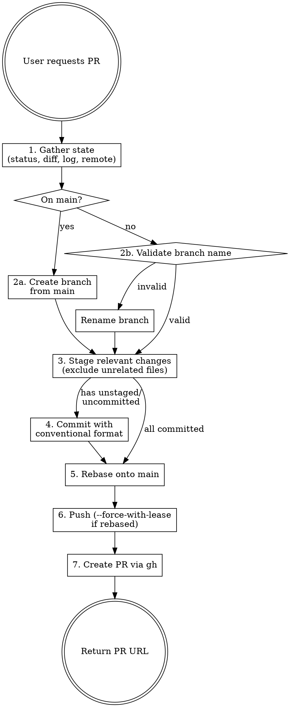

# GitHub Pull Request

Prepare and open a clean, reviewable Pull Request on GitHub.

## Overview

A PR-ready branch must be: on a correctly named branch, rebased onto main, with only relevant changes committed using conventional commits. This skill enforces that — no messy diffs, no stale branches, no unrelated files.

## Workflow



## Steps

### 1. Gather state

Run in parallel:

```bash
git status
git diff                          # unstaged changes
git diff --cached                 # staged changes
git log main..HEAD --oneline      # commits ahead of main
git log --oneline -10             # recent commit style
git fetch origin main             # ensure main is current
git rev-list --left-right --count origin/main...HEAD  # how far behind/ahead
```

### 2. Branch

**If on main:** Create a new branch before anything else. Derive the name from the actual changes — never use placeholders like `short-description`.

```bash
git checkout -b <type>/<description>
```

**If only some commits should be in the PR:** Create a new branch from `origin/main` and cherry-pick only the relevant commits:

```bash
git checkout -b <type>/<description> origin/main
git cherry-pick <commit-hash>
```

**If on a named branch:** Validate the name matches convention:

| Prefix | Commit type |
|--------|------------|
| `feature/` | `feat` |
| `fix/` | `fix` |
| `chore/` | `chore` |
| `docs/` | `docs` |
| `test/` | `test` |
| `refactor/` | `refactor` |
| `style/` | `style` |
| `perf/` | `perf` |

If the branch name doesn't match, rename it:

```bash
git branch -m old-name <type>/<description>
```

If the old name was already pushed, the old remote ref will be cleaned up after pushing the new name. This is standard branch hygiene, not a destructive operation.

### 3. Stage relevant changes only

Analyze the diff to decide what belongs. Stage files individually by path — never use `git add .` or `git add -A`.

**Exclude:**
- Auto-generated files not related to the change (lock files, import maps, compiled output)
- `.env*`, credentials, secrets — never commit these
- Untracked personal files (notes, scratch files)
- Changes unrelated to the PR's purpose

**Include:**
- All files directly related to the change
- Lock files ONLY if a dependency was intentionally added/removed as part of this work
- Generated files ONLY if they result from the committed changes (e.g., updated types, migrations)

Make the call yourself by inspecting the diff content. Do not ask the user about each file — analyze whether the change is related and act. Only ask if truly ambiguous after inspection.

### 4. Commit

Use conventional commits format. Derive type and scope from the actual changes:

```
<type>(<scope>): <description>
```

- Message explains WHY, not WHAT
- Keep the first line under 72 characters
- If there are already well-formed commits on the branch, don't re-commit — move to step 5

### 5. Rebase onto main

**Always rebase onto main before opening a PR.** This is mandatory, not optional.

```bash
git fetch origin main
git rebase origin/main
```

If conflicts arise, resolve them. If resolution is non-trivial, inform the user and resolve together.

Rebasing a feature branch onto main is standard pre-PR hygiene. It is NOT a "destructive operation" — it ensures the PR is reviewable and mergeable.

### 6. Push

```bash
# First push
git push -u origin <branch-name>

# After rebase (history rewritten)
git push --force-with-lease
```

Always use `--force-with-lease` after rebase, never `--force`. This protects against overwriting someone else's pushes.

### 7. Create PR

Generate title and body from the actual diff and commit history — never guess or use placeholders.

```bash
gh pr create --base main \
  --title "<type>(<scope>): <concise description>" \
  --body "$(cat <<'EOF'
## Summary
<1-3 bullets describing what changed and why>

## Test plan
<Checklist of verification steps>
EOF
)"
```

**Title:** Under 70 characters, conventional commit format, derived from the diff.
**Summary:** Bullet points covering the actual changes, not restating the title.
**Test plan:** Concrete verification steps a reviewer can follow.

Return the PR URL when done.

## Common Mistakes

| Mistake | Fix |
|---------|-----|
| Opening PR without rebasing | Always `git rebase origin/main` first |
| Including unrelated files in the diff | Stage by explicit path after analyzing each change |
| Asking user about every file | Analyze the diff yourself, only ask if truly ambiguous |
| Refusing to rename a pushed branch | Rename locally, push new name, it's routine |
| Using `--force` instead of `--force-with-lease` | Always `--force-with-lease` to protect shared branches |
| Using `git add .` | Stage specific files by path |
| Placeholder text in PR body | Derive everything from the actual diff and commits |
| Skipping rebase because "main is far ahead" | That's exactly when rebasing matters most |
